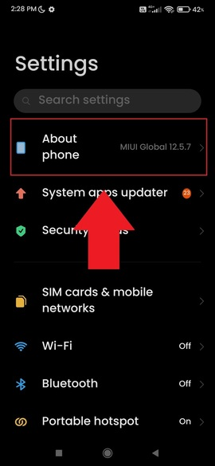

Installing the latest updates is one of the most important things you can do to keep your computer secure. Updates are released to fix security vulnerabilities and to add new features. If you don't install the latest updates, you are leaving your computer vulnerable to attack.

## Desktop

### Windows

#### Windows 10

By default, Windows 10 downloads and installs updates automatically in the background. However, there may be times when you want to manually check for and install updates. To do that, you just need to follow the steps mentioned below:

**Step 1**: Click on the **Windows** icon in the lower left corner of the screen.

**Step 2**: Click on the **gear icon**. This will open the Settings window.

**Step 3**: Click on **Updates and Security**. This will open the **Updates page**.

**Step 4**: Click on the **Check for Updates** button. Windows will start looking for any available updates.

**Step 5**: There are two scenarios possible here:

  a.	There are no updates available for your device. That means your device is up-to-date. You can stop reading the tutorial.
 
  b.	There are some updates available for your device. In this case, Windows will automatically start downloading the update files for you.

**Step 6**: If any updates start downloading, wait for them to finish downloading.

**Step 7**: Once the updates finish downloading, You can either **restart your system now to install the updates or choose to restart later**. In case you choose to restart later, keep in mind that whenever you switch on your PC next, Windows will automatically start installing the updates.

Also, please note that if there are frequent **power cuts** in your area, you should only install updates when you are most certain that power won’t be cut. If your computer **shuts down** in the **middle of an update** due to a power outage or the laptop battery dying, it can **corrupt** your operating system. This can result in you losing access to your files stored on the computer. So do take care.

#### Windows 11

TODO: Write about Windows 11 updates

#### Older Windows Versions

If you are using an older version of Windows, you should upgrade to Windows 10. If you are unable to upgrade, you should disconnect it from the internet and only use it for offline tasks.
You could also consider installing a Linux distribution.

### MacOS

TODO: Write about MacOS updates

### Linux

#### Gnome based distributions (Ubuntu, Fedora, etc.)

1. Open the "Software" application

2. Click on "Updates"

3. Click on the blue buttons for installing all updates or installing system updates.

Eventually, you computer will reboot and the updates will be installed.

Sometimes you will see a "Install Updates" checkbox in the Power Off-/ Restart-Confirmation dialog. If you check this checkbox, the updates will be installed automatically.

## Smartphone

### Android

The exact steps that you need to follow in order to update your Android operating system will vary from device to device.

Listed below are steps on how to update Android on MI, Oppo, and Samsung devices. Do not worry if you have some other manufacturers smartphone. The steps listed below should give you a general idea of how to update your device.

### Some things to keep in mind before updating your Android:

- It is advised that you connect to WiFi before updating your device. This is because updates can be very large. This can cause you to exhaust your daily data limit or cause your monthly phone data bill to skyrocket.

- Do not turn off the phone while the update is being installed.

### How do I update Android on MI devices?
**Step 1**: Open the **Settings** app on your phone.

**Step 2**: Find the **About Phone** section and click on it.

**Step 3**: Click on the **MIUI version** tab. Your device will automatically start looking for any updates available.

**Step 4**:Click on the **Check For Updates** button.

**Step 5**: There are two scenarios possible here:

  a.There are no updates available for your device. In this case, you are good to go, and you can stop reading the tutorial.

  b.There are some updates available for your device. If this is the case, then proceed to step 5.

**Step 6**: If an update is available, it will be shown on the screen. Also, the update size may be mentioned.

**Step 7**: Click on the **download** button to start downloading the update.

**Step 8**: Once the update finishes downloading, you will **need to restart** your phone to install it. You can either choose to restart now or at a later point.

**Step 9**: Your phone will restart and start installing the update. The progress of the update will be shown on the screen.

**Step 10**: Once the update is installed, your phone will be ready to use as usual.

### How do I update Android on Oppo devices?
**Step 1**: Open the **Settings app** on your phone.

**Step 2**: Find the **Software Update** section and click on it.

**Step 3**: Your device will automatically start looking for any updates available.

**Step 4**: There are two scenarios possible here:

  a. There are no updates available for your device. In this case, you are good to go, and you can stop reading the tutorial.

  b. There are some updates available for your device. If this is the case, then proceed to step 5.

**Step 5**: If an update is available, it will be shown on the screen. Also, the update size may be mentioned.

**Step 6**: Click on the **download button** to start downloading the update.

**Step 7**: Once the update finishes downloading, you will need to restart your 
phone to install it. You can either choose to restart now or at a later point.

**Step 8**: Your phone will restart and start installing the update. The progress of the update will be shown on the screen.

**Step 9**: Once the update is installed, your phone will be ready to use as usual.

### How do I update Android on Samsung devices?
**Step 1**: Open the **Settings** app on your phone.

**Step 2**: Find the **Software Update** section and click on it.

**Step 3**: Click on **Download and Install**. Your device will automatically start looking for any updates available.

**Step 4**: There are two scenarios possible here:

  a. There are no updates available for your device. In this case, you are good to go, and you can stop reading the tutorial.

  b. There are some updates available for your device. If this is the case, then proceed to step 5.

**Step 5**: If an update is available, it will be shown on the screen. Also, the update size may be mentioned.

**Step 6**: Click on the download button to start downloading the update.

**Step 7**: Once the update finishes downloading, you will need to restart your phone to install it. You can either choose to restart now or at a later point.

**Step 8**: Your phone will restart and start installing the update. The progress of the update will be shown on the screen.

**Step 9**: Once the update is installed, your phone will be ready to use as usual.

### iOS

TODO: Write about iOS updates
